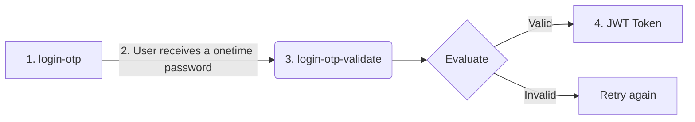

There are three ways of authentication depending on your needs. Start with the simplest querystring
authentication to learn how the API works.

- [Add your API key to the querystring with key=your_api_key](#querystring-authentication)
- [Add your API key to the request headers with x-api-key=your_api_key](#request-header-authentication)
- [Login the user with our one-time-password feature that retrieves a JWT token](#login-user-and-retrieve-jwt-token)

### Querystring authentication

This is the simplest way to authenticate typically used to simply share code between internal developers to
try things out or to simply HACK togheter something cool but it will expose your API key directly in the URL.
**So use with caution**. Add a querystring parameter with the name key=your_api_key and that’s all.

Example: Search for a company by name adding the API key to the url

```bash cURL
curl https://api.tic.io/search/companies?
q=the+intelligence+company&query_by=names?key=your_api_key
```

### Request header authentication

This is the most used way of authenticating especially if you are building internal integrations.
In the request header add the key x-api-key=your_api_key and that’s all.

```bash cURL
curl -H "x-api-key:your_api_key" https://api.tic.io/search/companies?q=57864
39&query_by=bankAccounts.accountNumber
```

### Login user and retrieve JWT token

This way of authenticating is typically used only when there are external applications where you need to
access the API with the users credentials. This feature is only granted by approved applications.

The process is summarized in the flow chart below and step-by-step instructions.



**1. First Step - send a one-time password**

Issue a HTTP POST to login-otp with the user e164PhoneNumber or emailAddresses.

```bash cURL
curl https://api.tic.io/ask_for_approval/login-otp
-d '{
    "e164MobilePhoneNumber": "+461234567",
    "email": "user-email@domain.tld"
}'
```

```json Response
{
  "userGuid": "DAE48E21-E457-44AB-8DB1-8859E3424179",
  "validationCodeValidUntilUtc": "2024-06-18T12:01:24"
}
```

**2. Second Step - validate the one-time password**

A one-time password will be sent to the mobile phone number valid only for a shorter time.

**3. Third step - validate the one-time password**

Issue a HTTP POST to login-otp-validate with the userguid and one-time password.

```bash cURL
curl https://api.tic.io/ask_for_approval/login-otp-validate
-d '{
    "userGuid": "DAE48E21-E457-44AB-8DB1-8859E3424179",
    "validationCode": "<received by the user>"
}'
```

```json Response
{
  "userGuid": "DAE48E21-E457-44AB-8DB1-8859E3424179",
  "token": "<JWT Token>",
  "tokenExpiresAtUtc": "2024-07-18T12:02:10"
}
```

4. Fourth Step - how to reuse the JWT token

The JWT token can be added in the request header as Bearer.

```bash cURL
> curl -H "Authorization: Bearer <JWT Token>" https://api.tic.io/search/companies?q=57864
39&query_by=bankAccounts.accountNumber
```
